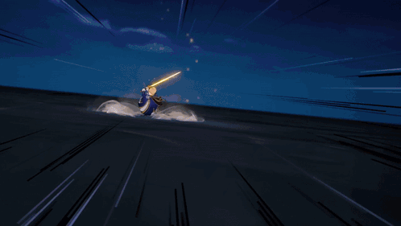

<h1 align="center">Hello there, I'm Djully! </h1>

  

  

### 🎮 About me

- 🎓 Computer Engineering student at **UPE**, probably debugging something right now
- 🕹️ Into **game development**, mostly living in **Godot 4 + C#**
- 🏆 Won **INOVA UPE** — an open innovation competition with real solution development and prototyping, where I led the team from idea to pitch
- 🧭 I like running **teams and sprints** — planning, standups, actually shipping stuff on time (mostly)
- 🀄 Learning Chinese, currently on a mission to pass **HSK 1**
- ⚡ Survived more than one 48-hour game jam and somehow keep coming back for more

### 🚧 Currently building

Working on **Down Grade** 🖥️ — a game made in 48h for a vaporwave-themed game jam. You explore an old Windows desktop, get guided by a mysterious pet, and eventually end up dodging attacks as a mouse in Undertale-style battles. Yes, it's as chaotic as it sounds.

### 🛠️ Tools & tech

  
  
  
  
  
  

### 📊 Stats

  
  

  

### 📬 Let's talk

  
  

---

<i>"Every line of code is a new piece of lore." 🌇</i>

  

<b>That's it, that's the profile 🎬</b>

